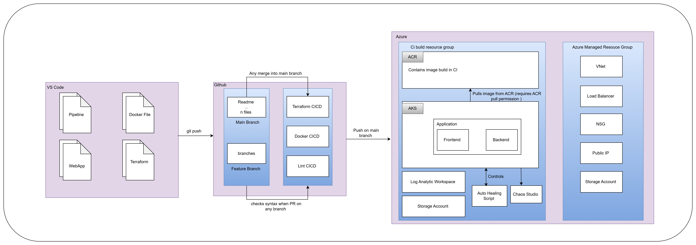

# Mini-Google-Style-SRE-Platform
The Mini Google-Style SRE Platform is a hands-on, system designed to implement Site Reliability Engineering (SRE) principles for modern production environments. Inspired by Google’s SRE framework, this platform focuses on ensuring the `reliability`, `availability`, `scalability`, and `performance` of services through automation, monitoring, and proactive incident management.


## Problem Statement :

- Modern systems that run on multiple servers and services are very complex and can easily run into problems like server crashes, slow networks, misconfigured settings, or software bugs. Traditional ways of managing these systems react to problems after they happen, which makes it hard to keep everything reliable, especially at large scale.

- This project aims to create a complete SRE (Site Reliability Engineering) platform that automates everything: setting up servers, deploying updates, monitoring performance, sending alerts, responding to incidents, and recovering from failures. 

- The system is designed to fail on purpose so that we can test and verify reliability features like auto-healing, automatic rollbacks, and chaos testing. This way, we can make sure the platform can handle real-world problems smoothly. 


## Objectives :


- Build a complete SRE ecosystem using modern DevOps and SRE practices 

- Implement Infrastructure as Code (IaC) for consistent and repeatable deployments 

- Design CI/CD pipelines with reliability and rollback mechanisms 

- Implement real-time monitoring, alerting, and logging 

- Introduce chaos engineering to simulate failures 

- Enable auto-healing and incident management workflows 

- Measure and improve end-to-end system reliability 

## Folder Structure :


```
├── Dockerfile
├── README.md
├── References.md
├── terraform
│   ├── main.tf
│   ├── provider.tf
│   └── variable.tf
└── webApp
    ├── app.py
    ├── requirements.txt
    └── templates
        ├── hiring_team_results.html
        ├── index.html
        └── job_seeker_results.html
```

## Architecture Diagram




## Flow of the Project

1. Development:
Developers work on the Python web app (webApp/) and infrastructure code (terraform/).

2. Pull Request Validation:
On PR creation, the PR Lint Check pipeline runs to ensure code quality and syntax correctness.

3. Infrastructure Deployment:
Once changes are merged to the main branch, the Terraform CI/CD pipeline runs automatically to provision or update Azure infrastructure resources.

4. Docker Image Build & Deployment:
After Terraform provisioning, the Docker pipeline builds the application image and pushes it to Azure Container Registry.

5. Application Deployment & Monitoring:
The app runs on the Azure Kubernetes Service cluster provisioned by Terraform, with monitoring and logging enabled via Log Analytics.

### SRE Practices:

The platform supports:

- Infrastructure as Code (IaC) with Terraform for consistent environments.

- Continuous Integration and Deployment (CI/CD) with automated pipelines.

- Monitoring and Alerting via Azure Monitor and Log Analytics.

- Chaos Engineering by injecting faults during testing.

- Auto-Healing through Kubernetes mechanisms and scripted workflows.


## Here Project is divided into two parts Developer Focus and User Focus

# **Developer Focus** 
## 1.1 Overview of the Web App Structure : 

```
To demonstrate and implement all SRE principles in this project, we used the ATS Resume Scanner application as the base system. This application serves as a practical example to showcase infrastructure automation, monitoring, incident management, chaos testing, and auto-healing workflows.

```
For more detail

[Web App Details](https://github.com/Tanisha-221/ATS_Resume_Scanner)


###  How this Web App Supports SRE Principles


1. Modularity and Maintainability

- Separating app logic (app.py) and presentation (templates/) allows easier updates and debugging, which helps maintain reliability and speeds up incident resolution.

2. Instrumentation and Monitoring

- The app.py backend can be instrumented to emit logs, metrics, and traces for monitoring tools. This data is crucial for detecting performance issues or failures.

3. Fault Injection and Chaos Testing

- You can simulate failures (e.g., response delays, exceptions) within app.py or during rendering templates to test how the system behaves under stress or fault conditions.

4. Automation and CI/CD Integration

- Since the app structure is simple and clear, it can be easily integrated into automated pipelines for testing, deployment, and rollback.

5. Incident Response and Auto-Healing

- With proper monitoring and alerting integrated, any issues detected in app.py or the app’s performance can trigger automated workflows to restart services, rollback deployments, or notify the team.

## 1.2 DockerFile : 

- Defines the container image build steps for the Python web application:

- Uses Python 3.11 base image.

- Copies app source and installs dependencies.

- Exposes port 8080 and runs the app via app.py.

## 1.3 Terraform : 

### Contains the Terraform scripts for provisioning Azure resources required for the platform.

- `main.tf`: Defines all Azure resources including Resource Group, AKS (Azure Kubernetes Service) cluster, Container Registry, Log Analytics workspace, and Storage Account.

- `provider.tf`: Configures the Terraform providers used, specifically the Azure provider and the random number generator provider.

- `variable.tf` : Contains configurable variables like resource group name, location, AKS cluster name, etc., to make the infrastructure reusable and flexible.

## 1.4 CI/CD Pipeline : 

### Project uses GitHub Actions to implement automated workflows ensuring code quality, infrastructure provisioning, and deployment automation. The pipelines are divided as follows:

### 1. PR Lint Check Pipeline (pr-lint-check.yaml)

- `Purpose:` Ensure code quality by performing syntax and style checks on Terraform, Dockerfile, and Python code before merging pull requests.

    Workflow:

        - Terraform: Initialize, format check, and validate Terraform files.

        - Dockerfile: Run Hadolint to check Dockerfile best practices.

        - Python: Run Python syntax check on the webApp/ folder.


### 2. Terraform CI/CD Pipeline (terraform-cicd.yaml)

- `Purpose:` Automate infrastructure provisioning on Azure using Terraform.

    Workflow:

        - Checkout code.

        - Setup Terraform CLI.

        - Authenticate with Azure using a service principal.

        - Initialize Terraform.

        - Format check Terraform files.

        - Run terraform plan to preview changes.

        - Apply changes with terraform apply to provision/update resources.

### 3. Docker Build and Push Pipeline (docker-image-ci.yaml)

-  `Purpose:` Build and push Docker images to Azure Container Registry (ACR).

    Workflow:

        - Checkout code.

        - Login to Azure and Azure Container Registry.

        - Build Docker image using the provided Dockerfile.

        - Push the image to ACR for deployment.


## Application Deployment & Monitoring

### Once the infrastructure is provisioned by Terraform, the application is deployed on an Azure Kubernetes Service (AKS) cluster. AKS is a managed Kubernetes service that simplifies the deployment, management, and scaling of containerized applications.

### Deployment Process :

1. `Containerized Application:`
The Python web app (app.py and associated files) is packaged into a Docker container image using the Dockerfile. This container encapsulates the app along with all its dependencies, ensuring consistency across environments.

2. `Image Storage:`
The Docker image is pushed to Azure Container Registry (ACR), a private Docker registry service hosted on Azure. ACR securely stores the container images and makes them available for AKS to pull and deploy.

3. `Kubernetes Cluster (AKS):`
AKS pulls the container image from ACR and deploys it on the cluster nodes. Kubernetes orchestrates container lifecycle management, including:

- Scheduling containers on available nodes.

- Managing container scaling based on load.

- Handling failover and self-healing by restarting or rescheduling containers if they crash or become unresponsive.

### Monitoring & Logging :

`Azure Monitor & Log Analytics:`
AKS is integrated with Azure Monitor and Log Analytics. This setup collects and aggregates logs, metrics, and performance data from the cluster and the running application.

### What is Monitored?

`Cluster health:` Node status, CPU/memory usage, pod availability

`Application metrics:` Response times, error rates, request throughput

`System logs:` Container logs, Kubernetes events, diagnostic traces

### Benefits of Monitoring:

- Enables proactive detection of anomalies or failures

- Provides insights to optimize performance and resource utilization

- Supports alerting systems that notify SRE teams instantly when issues arise

- Facilitates root cause analysis during incidents by providing rich logs and metrics


# **User Focus**

## Docker

- Uses the official Python 3.11 base image

- Sets /app as the working directory inside the container

- Copies the requirements.txt file from the local webApp/ directory into the container’s /app directory

- Installs all Python dependencies listed in requirements.txt

- Copies the entire application source code from webApp/ into /app inside the container

- Exposes port 8080 for HTTP traffic

- Runs the application using app.py

`Command`

- docker build

- docker push

## Terraform 

### Azure Resources Provisioned
1. Azure Resource Group
2. Random Identifier

3. Azure Container Registry (ACR) : A private Docker container registry hosted on Azure. Stores the Docker images   of your web application. When you build your application into a Docker image via CI/CD, it gets pushed here.

    ### SRE Value

        - Reliability: Images are versioned and stored securely.

        - Rollback: Older images can be redeployed if a new deployment fails.

        - Automation: Works seamlessly with your CI/CD pipeline.


4. Azure Kubernetes Service (AKS) : A managed Kubernetes cluster hosted on Azure. Runs your containerized web application.

    ### SRE Value

       - Availability: Ensures app keeps running even if a node fails.

       -  Scalability: Handles traffic spikes automatically.

       - Observability: Integrates with monitoring (Log Analytics).

5. Log Analytics Workspace : A central service for collecting and analyzing logs and metrics from Azure resources.

    ### SRE Value

        - Observability: You can see app performance and failures.

        - Proactive Alerts: Detect issues before users notice them.

        - Root Cause Analysis: Quickly investigate failures or performance issues.

6. Azure Storage Account

`Command`

- terraform init
- terraform fmt
- terraform validate
- terraform plan
- terraform apply


# Discuss About SLA SLO SLI


SLO (Service Level Objective) – A target set for an SLI, Focus on service health.
SLI (Service Level Indicator) – A metric that shows service performance, Focus on the performance target.
SLA (Service Level Agreement) – A contract with customers, Focus on customer commitment.

| Area          |               SLIs                                |               SLOs               |       SLA               |
| ------------- | ------------------------------------------        | ---------------------------------| ----------------------- |
|IaC            | Terraform apply success, drift detection          | ≥ 99.5% successful applies       | Internal                |
|CI/CD          | Pipeline success rate, rollback success           | ≥ 99% successful pipelines       | Platform SLA            |
|Docker         | build, pull image, Container restart,startup rate | ≥ 99% image build & pull success | Platform SLA            |
|Observability  | Alert latency, metrics/logs availability          | Alert latency < 60s              | Detect within min       |
| Auto-healing  | MTTR, auto-recovery success rate                  | MTTR < 5 min                     | Restore in 5min         |
| Chaos         |Chaos experiment success                           | -                                | -      
|               |                                                   |                                  |                         |


**MTTR stands for Mean Time To Recovery**

MTTR = the average time it takes to recover a service after a failure occurs

MTTR=Total downtime / Number of incidents

## Required Permission 

- Service Principal for credential
- Acr Pull authorization
- Contributor role


# Limitations :

In this project not able to perform Chaos Engineering because for that permission required from azure

 
- User access administrator write permission
- owner write permission

1. Roles with owner and user access administrator can start chaos engineering.
2. AKS requires acrpull authorization to pull image from acr.

This are the Current limitations of our projects